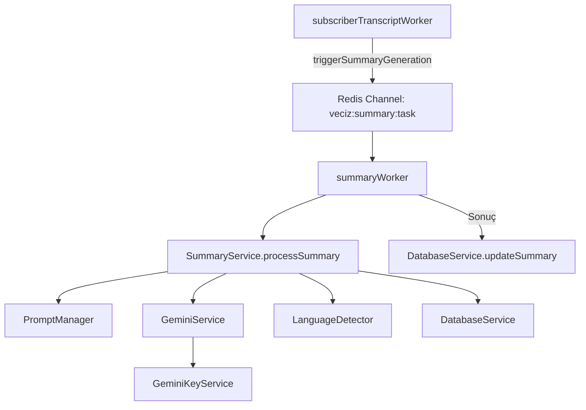

# VecizAI Özet Çıkarma Sistemi Dokümantasyonu

## İçindekiler
1. [Genel Bakış](#genel-bakış)
2. [Mimari ve Bileşenler](#mimari-ve-bileşenler)
3. [Özet Oluşturma İş Akışı](#özet-oluşturma-iş-akışı)
4. [Servisler ve Fonksiyonları](#servisler-ve-fonksiyonları)
5. [Worker'lar ve İşlevleri](#workerlar-ve-işlevleri)
6. [Veri Modelleri](#veri-modelleri)
7. [API Yapıları](#api-yapıları)
8. [Hata Yönetimi](#hata-yönetimi)

## Genel Bakış

VecizAI Özet Çıkarma Sistemi, YouTube video transkriptlerinin otomatik olarak özetlenmesini sağlayan bir sistemdir. Sistem, transkript indirildikten sonra Google'ın Gemini API'sini kullanarak transkriptleri analiz eder ve çeşitli formatlarda özetler üretir. Bu dokümantasyon, transkript indirme işlemi tamamlandıktan sonraki özet oluşturma sürecini detaylandırmaktadır.

### Temel Özellikler
- Transkriptlerin içerik türüne göre otomatik analizi
- Farklı içerik türleri için özelleştirilmiş promptlar
- Çoklu dil desteği ile özetleme
- Büyük transkriptler için chunking (parçalama) stratejisi
- Çoklu Gemini API anahtarı yönetimi ve yük dengeleme
- Özet sonuçlarının formatlı metin şeklinde sunulması

## Mimari ve Bileşenler

Özet oluşturma sistemi aşağıdaki temel bileşenlerden oluşur:

### Ana Bileşenler
1. **SummaryController**: Özet isteklerini işleyen kontrolcü
2. **SummaryService**: Özet oluşturma işlemlerini yöneten ana servis
3. **SummaryWorker**: Arkaplanda özet işlerini işleyen worker
4. **GeminiService**: Gemini API ile iletişim kuran servis
5. **PromptManager**: İçerik türüne göre promptları seçen ve yöneten servis
6. **LanguageDetector**: Dil tespiti ve doğrulaması yapan servis
7. **DatabaseService**: Özet verilerini veritabanında saklayan servis
8. **QueueService**: Özet işlerini kuyruğa ekleyen servis
9. **GeminiKeyService**: API anahtarlarını yöneten servis

### Bileşen İlişkileri



## Özet Oluşturma İş Akışı

Transkript indirildikten sonraki özet oluşturma süreci şu adımlardan oluşur:

1. **Özet Tetikleme**: Transkript tamamlandığında, `subscriberTranscriptWorker` içindeki `triggerSummaryGeneration` metodu çağrılır.

2. **Özet Kaydı Oluşturma**: Yeni bir özet kaydı için `summaryId` oluşturulur ve veritabanına kaydedilir.

3. **Redis Mesajı Gönderme**: Özet oluşturma işi için `veciz:summary:task` Redis kanalına mesaj gönderilir.

4. **İşin Alınması**: `summaryWorker` bu mesajı dinler ve `processTask` metodu ile işi alır.

5. **Özet İşlemi**: `SummaryService.processSummary` metodu çağrılır:
   - Transkript metni alınır
   - İçerik türü analiz edilir
   - Uygun prompt seçilir
   - Metin boyutu kontrol edilir:
     - Büyük metinler (>10,000 karakter) için chunking uygulanır
     - Her chunk için Gemini API'ye ayrı istek gönderilir
     - Sonuçlar birleştirilir
   - Sonuç formatlanır

6. **Dil Doğrulama**: Oluşturulan özetin dili kontrol edilir.

7. **Sonuç Kaydetme**: Özet ve formatlanmış içerik veritabanına kaydedilir.

8. **Bildirim**: İşlem tamamlandığında ilgili Redis kanallarına bildirim gönderilir.

## Servisler ve Fonksiyonları

### 1. SummaryService
Özet oluşturma işlemlerini yöneten ana servistir.

```typescript
// backend/src/services/summaryService.ts
```

#### Önemli Metotlar:
- `generateSummary(videoId, language, userId, fromCron)`: Özet oluşturma sürecini başlatır
- `processSummary(videoId, language, summaryId)`: Özet içeriğini oluşturur
- `formatSummary(text)`: Oluşturulan özeti formatlar
- `chunkText(text, maxChunkSize)`: Büyük metinleri parçalara böler

### 2. GeminiService
Gemini API ile iletişimi sağlayan servistir.

```typescript
// backend/src/services/geminiService.ts
```

#### Önemli Metotlar:
- `generateSummary(prompt, transcript, apiKey)`: Gemini API'ye istek gönderir ve özet alır
- `buildGeminiRequest(prompt, transcript)`: Gemini API'ye gönderilecek istek yapısını oluşturur
- `processGeminiResponse(response)`: API yanıtını işler
- `handleGeminiError(error, apiKey)`: API hatalarını yönetir

### 3. PromptManager
İçerik türüne göre uygun promptları seçen servistir.

```typescript
// backend/src/services/promptManager.ts
```

#### Önemli Metotlar:
- `getPrompt(language, contentType)`: Dil ve içerik türüne göre prompt seçer
- `categorizeContent(transcript)`: Transkript içeriğini analiz ederek türünü belirler
- `fillPromptTemplate(template, params)`: Prompt şablonunu doldurur
- `getPromptTemplate(contentType)`: İçerik türüne göre şablon seçer

### 4. LanguageDetector
Dil tespiti ve doğrulaması yapan servistir.

```typescript
// backend/src/services/languageDetector.ts
```

#### Önemli Metotlar:
- `detectLanguage(text)`: Metnin dilini tespit eder
- `validateLanguage(text, expectedLanguage)`: Metnin belirtilen dilde olup olmadığını kontrol eder
- `getLanguageConfidence(text, language)`: Dil tespitinin güven skorunu hesaplar
- `normalizeLanguageCode(languageCode)`: Dil kodunu standart formata dönüştürür

### 5. DatabaseService
Özet ve ilgili verileri veritabanında saklayan servistir.

```typescript
// backend/src/services/databaseService.ts
```

#### Önemli Metotlar:
- `getSummary(videoId, language)`: Özet verilerini getirir
- `createSummary(summary)`: Yeni özet kaydı oluşturur
- `updateSummary(summaryId, updates)`: Özet kaydını günceller
- `getTranscript(videoId, language)`: Transkript verilerini getirir

### 6. GeminiKeyService
Gemini API anahtarlarını yöneten servistir.

```typescript
// backend/src/services/geminiKeyService.ts
```

#### Önemli Metotlar:
- `getActiveKey()`: Kullanılabilir bir API anahtarı döndürür
- `recordKeyUse(key)`: API anahtarı kullanımını kaydeder
- `markKeyError(key, errorType)`: API anahtarında oluşan hatayı işler
- `reactivateKeys()`: Devre dışı bırakılmış anahtarları kontrol eder ve yeniden aktifleştirir

### 7. SummaryCacheService
Özet verilerini önbellekte saklayan servistir.

```typescript
// backend/src/services/summaryCacheService.ts
```

#### Önemli Metotlar:
- `getFromCache(videoId, language)`: Önbellekten özet getirir
- `setToCache(videoId, language, data)`: Özeti önbelleğe kaydeder
- `invalidateCache(videoId, language)`: Önbelleği geçersiz kılar

## Worker'lar ve İşlevleri

### 1. SubscriberTranscriptWorker
Transkript işlemlerini yöneten worker'dır. Özet oluşturma sürecini başlatma görevi burada yer alır.

```typescript
// backend/src/workers/subscriberTranscriptWorker.ts
```

#### Önemli Metotlar:
- `processTask(data)`: Transkript görevini işler
- `saveTranscriptToDB(transcriptId, result, source)`: Transkripti veritabanına kaydeder
- `markTranscriptCompleted(transcriptId, text)`: Transkript işlemini tamamlandı olarak işaretler
- `triggerSummaryGeneration(videoId, language, transcriptId)`: Özet oluşturma sürecini başlatır

### 2. SummaryWorker
Özet oluşturma görevlerini işleyen worker'dır.

```typescript
// backend/src/workers/summaryWorker.ts
```

#### Önemli Metotlar:
- `processTask(task)`: Özet görevini işler
- `updateSummaryStatus(summaryId, status, error)`: Özet durumunu günceller

### 3. SubscriberWorker
Worker'lar için temel sınıf, Redis kanallarını dinleme ve mesaj alımını sağlar.

```typescript
// backend/src/workers/subscriberWorker.ts
```

#### Önemli Metotlar:
- `start()`: Worker'ı başlatır
- `stop()`: Worker'ı durdurur
- `checkQueueForTasks()`: Kuyrukta bekleyen görevleri kontrol eder

## Veri Modelleri

### Summary (Özet) Modeli

```typescript
// backend/src/types/summary.ts
```

```typescript
export interface Summary {
  id: string;
  video_id: string;
  source: string;
  content: string;
  formatted_content: string; // Markdown formatında özet içeriği
  language: string;
  status: 'pending' | 'processing' | 'completed' | 'failed';
  error?: string;
  created_at: Date;
  updated_at: Date;
  is_public: boolean;
}
```

### ContentType (İçerik Türü) Enum

```typescript
export type ContentType = 
  | 'education'
  | 'history'
  | 'finance'
  | 'technology'
  | 'news'
  | 'science'
  | 'art'
  | 'sport'
  | 'health'
  | 'general';
```

## API Yapıları

### Özet Endpoints

#### 1. Özet Oluşturma
```
POST /api/summaries/create
```

**Request Body:**
```json
{
  "videoId": "string",
  "language": "string",
  "isPublic": boolean
}
```

#### 2. Özet Durumu Kontrolü
```
GET /api/summaries/status/:videoId
```

#### 3. Özet Getirme
```
GET /api/summaries/:videoId
```

## Hata Yönetimi

Sistem, özet oluşturma sürecinde oluşabilecek çeşitli hataları ele alır:

1. **Transkript Bulunamadı**: İşlenecek transkript veritabanında bulunamadığında
2. **API Limiti Aşıldı**: Tüm API anahtarları tükendiğinde
3. **Dil Doğrulama Hatası**: Oluşturulan özetin dili beklenen dilden farklı olduğunda
4. **İçerik Türü Belirleme Hatası**: İçerik türü belirlenemediğinde
5. **Gemini API Hatası**: API yanıt vermediğinde veya hata döndürdüğünde

Her hata durumu loglanır ve özet kaydının durumu 'failed' olarak işaretlenir.