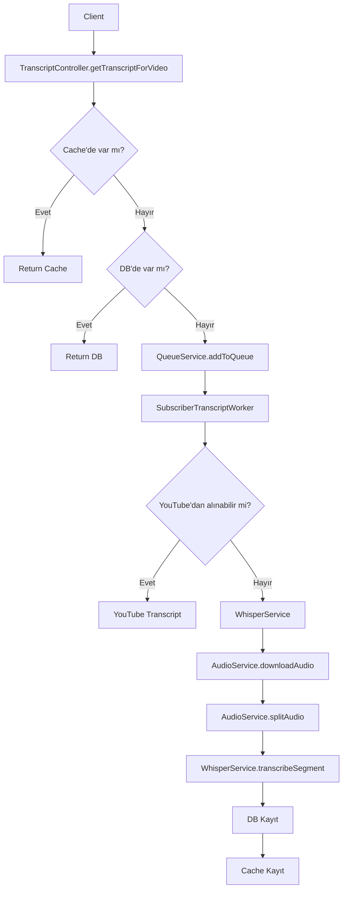
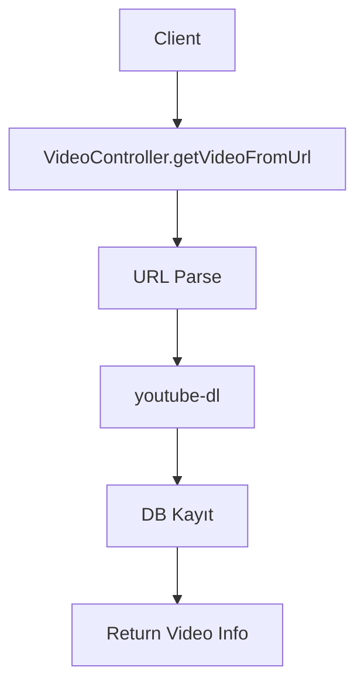
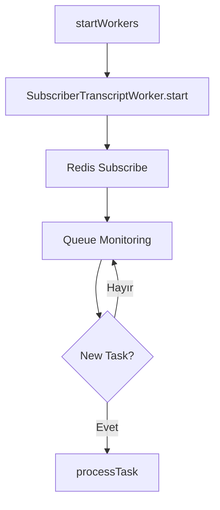

summaryService.ts dosyasını inceledim. Bu servis, video özetlerinin oluşturulması ve yönetilmesi için ana servistir. İşte önemli noktalar:
Ana Bileşenler:
GeminiService: Özet oluşturmak için Gemini AI modelini kullanır
DatabaseService: Veritabanı işlemleri için
PromptManager: AI modeline gönderilecek promptları yönetir
LanguageDetector: Dil tespiti için
cacheService: Önbellekleme için
Redis ve Supabase bağlantıları
Kilit Fonksiyonlar:
generateSummary: Özet oluşturma sürecini başlatır
processSummary: Asıl özet oluşturma işlemini yapar
validateLanguageOutput: Oluşturulan özetin dil kontrolünü yapar
translateText: Gerekirse çeviri yapar
handleTranscriptCompletion: Transkript tamamlandığında özet işlemini başlatır
Özet Oluşturma Süreci:
Önce cache kontrolü yapılır
Veritabanında mevcut özet kontrolü yapılır
Duruma göre (completed, pending, failed, processing) farklı işlemler yapılır
Yeni özet oluşturulacaksa:
Transkript kontrolü yapılır
Yeni özet kaydı oluşturulur
Queue'ya işlem eklenir
Hata Yönetimi ve Timeout:
Lock mekanizması ile eşzamanlı işlemleri yönetir
15 dakikalık timeout süresi var
Detaylı loglama yapılıyor
Performans Optimizasyonları:
Caching kullanılıyor
Text chunking ile büyük metinler parçalanıyor
Lock mekanizması ile gereksiz işlemler engelleniyor
Bu servis, video özetleme sisteminin omurgasını oluşturuyor ve transkript servisi ile yakın çalışıyor. Özellikle hata yönetimi ve performans optimizasyonları dikkat çekici.
Şimdi de geminiService.ts dosyasını inceleyelim, çünkü asıl özet oluşturma işlemi orada gerçekleşiyor:
geminiService.ts dosyasını inceledim. Bu servis, Gemini AI modelini kullanarak özetleme işlemlerini gerçekleştiriyor. İşte önemli noktalar:
Model Yapılandırması:
gemini-1.5-flash-8b modelini kullanıyor
Güvenlik ayarları esnek tutulmuş (BLOCK_ONLY_HIGH)
Temperature: 0.6 (daha güvenli çıktılar için)
Max output tokens: 2048
API Yönetimi:
GeminiKeyService ile API anahtarlarını yönetiyor
API anahtarı rotasyonu ve hata yönetimi var
Kullanım istatistikleri tutuluyor
Özet Oluşturma Süreci:
Prompt ve transkript birleştiriliyor
Model parametreleri optimize edilmiş
Detaylı loglama yapılıyor
Hata durumları yönetiliyor
Güvenlik ve Optimizasyon:
API anahtarları maskelenerek loglanıyor
İstek boyutları ve süreler takip ediliyor
Hata durumlarında otomatik anahtar rotasyonu
Performans Ayarları:
Temperature: 0.4 (özet oluşturma için)
Top-k: 32
Top-p: 0.95
Max output tokens: 4096
Bu iki servisin (summaryService.ts ve geminiService.ts) birlikte çalışma şekli şöyle:
summaryService.ts özet talebini alır ve yönetir
Gerekli kontrolleri yapar (cache, DB, vs.)
geminiService.ts'i kullanarak AI modelinden özet ister
Sonucu alıp işler ve kaydeder
Sistemin genel akışı mantıklı ve iyi organize edilmiş durumda. Özellikle hata yönetimi ve performans optimizasyonları dikkat çekici.
Şimdi de promptManager.ts dosyasını inceleyelim, çünkü Gemini'ye gönderilen promptlar orada yönetiliyor:
promptManager.ts dosyası, farklı içerik türleri için özelleştirilmiş prompt şablonlarını yöneten bir sınıf içeriyor. İşte önemli noktalar:
İçerik Türü Tespiti:
categorizeContent metodu, transkripti analiz ederek içerik türünü belirliyor
Anahtar kelime bazlı basit bir kategorizasyon kullanıyor
10 farklı kategori var: eğitim, tarih, finans, teknoloji, haberler, bilim, sanat, spor, sağlık ve genel
Prompt Yönetimi:
Her içerik türü için özelleştirilmiş prompt şablonları var
Şablonlar dil parametresi ile dinamik olarak doldurulabiliyor
Hata durumunda genel bir prompt'a geri dönüş yapılıyor
Özelleştirilmiş Promptlar:
Eğitim içeriği için detaylı bir yapı (6 bölüm)
Tarih içeriği için kronolojik bir format
Finans içeriği için risk analizi ve yatırım odaklı yapı
Chunk Yönetimi:
Uzun metinler için chunk bazlı prompt oluşturma
İlk chunk ve sonraki chunklar için farklı promptlar
Final özeti için ayrı bir prompt
Hata Yönetimi:
Her aşamada try-catch blokları
Genel prompt'a fallback mekanizması
Bu üç servisin (summaryService.ts, geminiService.ts, ve promptManager.ts) birlikte çalışma akışı şöyle:
summaryService özet talebini alır
promptManager içerik türünü belirler ve uygun promptu hazırlar
geminiService bu promptu kullanarak AI modelinden özet ister
Sonuç işlenir ve kullanıcıya döndürülür
Sistemin güçlü yanları:
İçerik türüne göre özelleştirilmiş özetleme
Modüler ve bakımı kolay yapı
Detaylı hata yönetimi
Chunk bazlı işleme ile uzun metinleri destekleme
İyileştirilebilecek alanlar:
İçerik türü tespiti daha gelişmiş NLP teknikleri kullanılarak geliştirilebilir
Prompt şablonları A/B testi ile optimize edilebilir
Daha fazla içerik türü eklenebilir
Chunk boyutları ve model parametreleri dinamik olarak ayarlanabilir


şimdi surada kaldık 

# VecizAI Sistem Dokümantasyonu

## İçindekiler
1. [Kontrolcüler (Controllers)](#kontrolcüler-controllers)
2. [Servisler (Services)](#servisler-services)
3. [Worker'lar (Workers)](#workerlar-workers)
4. [Veri Modelleri](#veri-modelleri)

## Kontrolcüler (Controllers)

### TranscriptController
Transkript işlemlerini yöneten ana kontrolcü.

#### Fonksiyonlar:

1. `getTranscriptForVideo(req, res)`
   - **Amaç**: Video ID ve dil için transcript döndürür veya yeni task oluşturur
   - **İş Akışı**:
     - Redis cache'de kontrol eder
     - Supabase'de transcript tablosunda kontrol eder
     - Yoksa yeni transcript oluşturur ve Redis queue'ya ekler
   - **Parametreler**: 
     - videoId: string
     - language: string (default: 'tr')

2. `getTranscriptStatus(req, res)`
   - **Amaç**: Transcript'in detaylı durumunu kontrol eder
   - **Döndürdüğü Bilgiler**:
     - Durum
     - Oluşturulma zamanı
     - Güncellenme zamanı
     - Hata varsa hata mesajı

3. `updateTranscript(req, res)`
   - **Amaç**: Mevcut bir transcript'i günceller
   - **İşlemler**:
     - Video ID ve dil ile transcript'i bulur
     - Gelen verilerle günceller
     - Cache'i günceller

4. `deleteTranscript(req, res)`
   - **Amaç**: Transcript'i siler
   - **İşlemler**:
     - Veritabanından siler
     - Cache'den siler

### VideoController
Video işlemlerini yöneten kontrolcü.

#### Fonksiyonlar:

1. `getVideoFromUrl(req, res)`
   - **Amaç**: YouTube URL'sinden video bilgilerini çeker
   - **İşlemler**:
     - Video ID'yi URL'den ayıklar
     - youtube-dl ile video bilgilerini çeker
     - Veritabanına kaydeder

2. `createVideo(req, res)`
   - **Amaç**: Yeni video kaydı oluşturur

3. `getVideo(req, res)`
   - **Amaç**: Video bilgilerini getirir

4. `getAllVideos(req, res)`
   - **Amaç**: Tüm videoları listeler

## Servisler (Services)

### AudioService
Ses dosyası işlemleri için servis. Video'dan ses dosyası indirme, bölme ve temizleme işlemlerini yönetir.

#### Sorumluluklar:
- Video'dan ses dosyası indirme
- Ses dosyasını segmentlere bölme
- Ses dosyalarının temizlenmesi
- Ses dosyası süre kontrolü

#### Fonksiyonlar:

1. `downloadAudio(videoId)`
   - **Amaç**: YouTube videosundan ses dosyasını indirir
   - **Kontroller**:
     - Video süresini kontrol eder (max 3 saat)
     - Dosya zaten varsa tekrar indirmez
   - **Dönüş**: İndirilen ses dosyasının yolu

2. `splitAudio(inputPath, segmentDuration)`
   - **Amaç**: Ses dosyasını parçalara böler
   - **Parametreler**:
     - inputPath: Ses dosyası yolu
     - segmentDuration: Parça süresi (default: 600 saniye)
   - **Dönüş**: Segment dosyalarının yollarını içeren dizi

3. `cleanupAudio(videoId)`
   - **Amaç**: Ana ses dosyasını temizler
   - **İşlem**: Belirtilen videoId'ye ait ses dosyasını siler

4. `cleanupSegments(segments)`
   - **Amaç**: Segment dosyalarını temizler
   - **İşlem**: Verilen segment dosyalarını siler

5. `getVideoDuration(videoId)`
   - **Amaç**: Video süresini kontrol eder
   - **Dönüş**: Video süresi (saniye)

### WhisperService
Whisper AI modeli ile transkript oluşturma servisi. Sadece transkripsiyon işlemlerinden sorumludur.

#### Sorumluluklar:
- Whisper modelinin yönetimi
- Ses segmentlerinin transkripsiyonu
- Transkript sonuçlarının birleştirilmesi

#### Fonksiyonlar:

1. `transcribeVideo(audioSegments)`
   - **Amaç**: Verilen ses segmentlerini transkript eder
   - **Parametreler**:
     - audioSegments: string[] - Ses segment dosyalarının yolları
   - **İş Akışı**:
     - Her segmenti ayrı ayrı işler
     - Sonuçları birleştirir
   - **Dönüş**: WhisperApiResponse
     ```typescript
     {
       text: string;       // Tam metin
       segments: {         // Zaman damgalı segmentler
         text: string;     // Segment metni
         start: number;    // Başlangıç zamanı
         end: number;      // Bitiş zamanı
       }[];
       language: string;   // Dil kodu
     }
     ```

2. `transcribeSegment(audioPath, timeOffset)`
   - **Amaç**: Tek bir ses segmentini transkript eder
   - **Parametreler**:
     - audioPath: Segment dosya yolu
     - timeOffset: Zaman ofseti (saniye)
   - **Dönüş**: Segment transkript sonucu

3. `mergeResults(results)`
   - **Amaç**: Segment sonuçlarını birleştirir
   - **İşlem**: 
     - Segmentleri sıralar
     - Metinleri birleştirir
     - Zaman damgalarını düzenler

### QueueService
Redis tabanlı kuyruk yönetim servisi.

#### Fonksiyonlar:

1. `addToQueue(task)`
   - **Amaç**: Yeni görev ekler

2. `getNextTask(type)`
   - **Amaç**: Sıradaki görevi alır

3. `markTaskComplete(type, transcriptId)`
   - **Amaç**: Görevi tamamlandı olarak işaretler

4. `markTaskFailed(type, transcriptId, error)`
   - **Amaç**: Görevi başarısız olarak işaretler

### TranscriptCacheService
Transkript önbellek yönetim servisi.

#### Fonksiyonlar:

1. `getFromCache(videoId, language)`
   - **Amaç**: Cache'den transkript getirir

2. `setToCache(videoId, language, data)`
   - **Amaç**: Transkripti cache'e kaydeder

3. `invalidateCache(videoId, language)`
   - **Amaç**: Cache'i geçersiz kılar

## Worker'lar (Workers)

### SubscriberTranscriptWorker
Redis Pub/Sub kullanarak transkript işlerini işleyen worker.

#### Özellikler:
- Redis üzerinden task bildirimleri alır
- Yeni task geldiğinde otomatik işlemeye başlar
- Hata durumunda tekrar deneme mekanizması

#### Ana Fonksiyonlar:

1. `processTask(data)`
   - **Amaç**: Transkript görevini işler
   - **İş Akışı**:
     - Önce YouTube'dan transkript almayı dener
     - Başarısız olursa Whisper'a geçer
     - Sonucu veritabanına kaydeder

2. `getYoutubeTranscript(videoId, language)`
   - **Amaç**: YouTube'dan transkript çeker
   - **Özellikler**:
     - Belirtilen dilde dener
     - Başarısız olursa otomatik oluşturulana geçer

### BaseWorker
Tüm worker'lar için temel sınıf.

#### Özellikler:
- Exponential backoff ile polling
- Hata yönetimi
- Durdurup başlatma kontrolü

### SubscriberWorker
Redis Pub/Sub mekanizmasını kullanan temel worker sınıfı.

#### Özellikler:
- Redis üzerinden task bildirimlerini dinler
- Polling yerine event-driven çalışır
- Minimum polling aralığı: 500ms
- Boşta kalma kontrolü: 60 saniye
- Yedek kontrol aralığı: 5 dakika

#### Ana Fonksiyonlar:

1. `start()`
   - **Amaç**: Worker'ı başlatır ve Redis subscription'ı oluşturur
   - **İşlemler**:
     - Redis bağlantısını kurar
     - Queue notification kanalına subscribe olur
     - Polling mekanizmasını başlatır

2. `stop()`
   - **Amaç**: Worker'ı ve subscription'ları durdurur
   - **İşlemler**:
     - Redis subscription'ı kapatır
     - Polling timeout'ları temizler

### StartWorkers
Worker'ları başlatan ve yöneten modül.

#### Fonksiyonlar:

1. `startWorkers()`
   - **Amaç**: Tüm worker'ları başlatır
   - **İşlemler**:
     - SubscriberTranscriptWorker'ı başlatır
     - Hata durumunda loglama yapar
     - Process sinyallerini (SIGINT) yönetir

### SampleWorker
Örnek worker implementasyonu.

#### Özellikler:
- BaseWorker'dan extend edilmiş
- Task işleme simülasyonu için 1 saniye bekler

#### Fonksiyonlar:

1. `processTask(data)`
   - **Amaç**: Örnek task işleme
   - **İşlemler**:
     - Task verilerini loglar
     - 1 saniye bekler
     - Tamamlandı bilgisi döner

## Veri Modelleri

### Transcript
```typescript
interface Transcript {
  id: string;
  video_id: string;
  language: string;
  status: TranscriptStatus;
  formatted_text: string;
  segments: TranscriptSegment[];
  error?: TranscriptError;
  created_at: string;
  updated_at: string;
}
```

### Video
```typescript
interface Video {
  video_id: string;
  title: string;
  description: string;
  channel_id: string;
  channel_title: string;
  published_at: string;
  thumbnail_url: string;
  view_count: number;
  like_count: number;
  comment_count: number;
  duration: string;
  status: string;
  available_languages: string[];
}
```

## Fonksiyon Çağrı Akışları

### 1. Transkript Oluşturma Akışı



### 2. Video İşleme Akışı



### 3. Worker Başlatma Akışı



### Önemli Fonksiyon Çağrıları

1. **Transkript İsteği**:
   - `GET /api/transcript/:videoId` --> `TranscriptController.getTranscriptForVideo`
   - `TranscriptController` --> `QueueService.addToQueue`
   - `SubscriberTranscriptWorker` --> `WhisperService.transcribeVideo`
   - `WhisperService` --> `AudioService.downloadAudio`

2. **Video İşleme**:
   - `POST /api/videos` --> `VideoController.getVideoFromUrl`
   - `VideoController` --> `youtube-dl`
   - `VideoController` --> `Supabase Insert`

3. **Worker Yönetimi**:
   - `npm start` --> `startWorkers()`
   - `startWorkers` --> `SubscriberTranscriptWorker.start()`
   - `SubscriberTranscriptWorker` --> `Redis Subscribe`

4. **Cache Yönetimi**:
   - `TranscriptController` --> `TranscriptCacheService.getFromCache`
   - `TranscriptController` --> `TranscriptCacheService.setToCache`
   - `TranscriptController` --> `TranscriptCacheService.invalidateCache` 