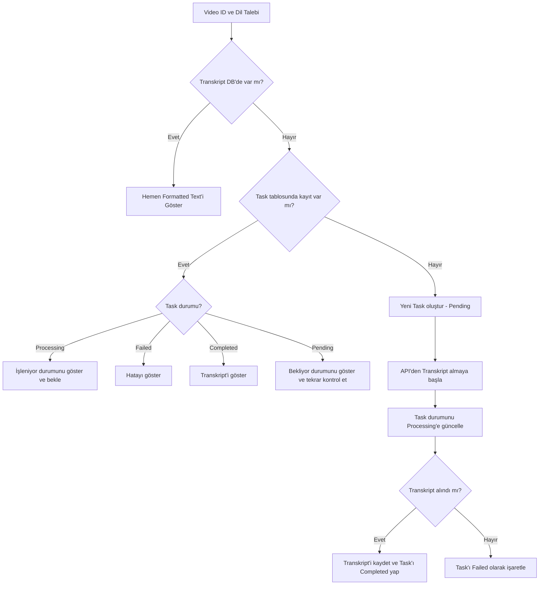

# Transkript İşleme Akışı

Aşağıdaki akış diyagramı, transkript işleme sürecini göstermektedir:

## İşlem Adımları

1. **Frontend**: Kullanıcı bir video ID ve dil seçerek transkript talep eder. 

2. **Backend**: Transkript tablosunda bu ID ve dil için bir kayıt var mı kontrol edilir:
   - Kayıt varsa: Formatted text hemen döndürülür.
   - Kayıt yoksa: Task tablosuna bakılır.

3. **Backend**: Task tablosunda ID ve dil için bir kayıt var mı kontrol edilir:
   - Task varsa: Durumuna (pending, processing, completed, failed) göre uygun yanıt döndürülür.
   - Task yoksa: Yeni bir task oluşturulur (pending).

4. **Worker**: Pending durumundaki task'ları bulur ve işlemeye başlar:
   - Task'ı Processing durumuna günceller
   - YouTube'dan transkript almaya çalışır
   - Transkript alınırsa: Transkript tablosuna kaydedilir ve task Completed olarak işaretlenir
   - Hata olursa: Task Failed olarak işaretlenir

5. **Frontend**: Polling ile task durumunu kontrol eder:
   - Transcript tamamlanmışsa: Kullanıcıya gösterilir
   - İşlem devam ediyorsa: Status mesajları ile kullanıcı bilgilendirilir
   - Hata durumunda: Kullanıcıya hata gösterilir

## Durum Kodları

- **pending**: Task oluşturuldu, henüz işleme alınmadı
- **processing**: Worker task'ı işliyor
- **completed**: İşlem başarıyla tamamlandı
- **failed**: İşlem sırasında hata oluştu

Bu akış, verimli ve sağlam bir transkript işleme sistemi sağlar. Başarısızlık durumlarını yönetir ve kullanıcıya süreç hakkında şeffaf bilgiler sunar.
